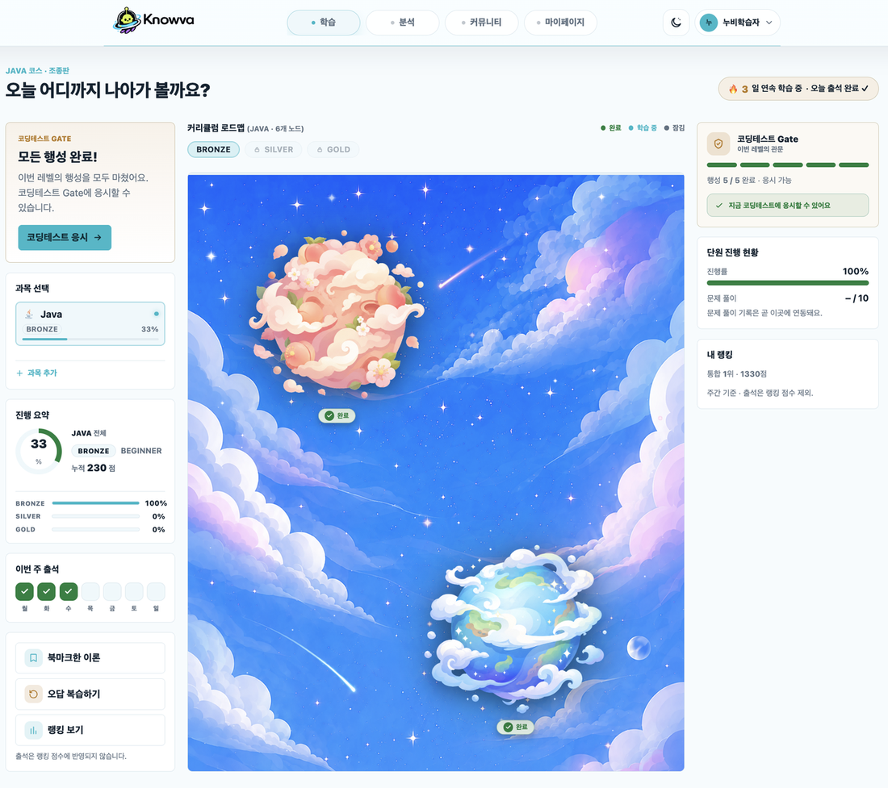
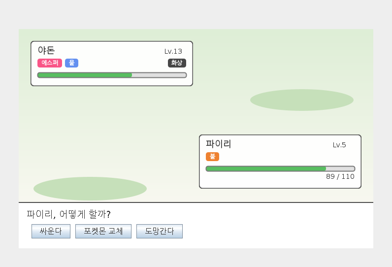
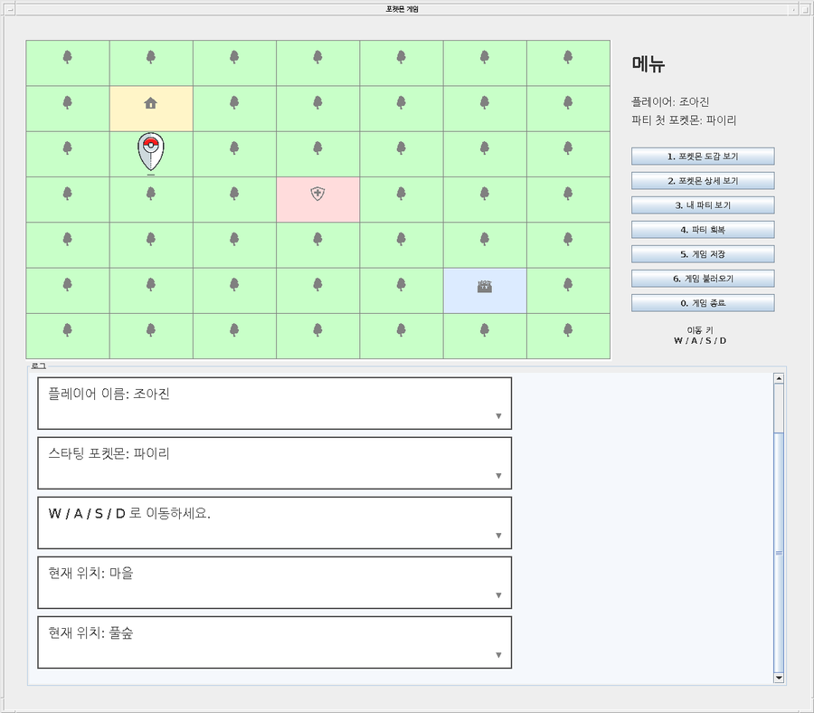

 

### 불편한 걸 말하는 쪽이 아니라, 직접 고치는 쪽이 되고 싶었습니다.

 

 

## 👋 About

요식업 현장에서 **5년 반**을 일했습니다.
조리 자격증 없이 실력만으로 **헤드셰프**까지 올라가 직원 관리와 발주, 레시피 관리를 맡았습니다.

거기서 멈추지 않고 개발로 방향을 튼 건, 불편한 걸 말하는 쪽이 아니라 **직접 고치는 쪽**이 되고 싶어서였습니다.

지금은 **규칙이 얽힌 데이터를 구조로 푸는 일**이 제일 즐겁습니다.
포켓몬 타입 상성표를 손으로 설계하다 키 하나가 안 맞아 며칠을 헤맸던 것도, 결국 그게 재미있어서 계속 붙잡고 있었습니다.

 

## 📦 Projects

### 🌌 Knowva — 우주 컨셉 E-러닝 플랫폼

<samp>팀 7명 · 진행 중 · <b>learning 도메인 전담</b></samp>

학습자가 **행성을 하나씩 밟아 나가며 진도를 쌓는** 학습 로드맵 서비스입니다.
저는 **학습(learning) 도메인 전체**를 맡아 `Controller → Service → Mapper → View` 세로 전 구간을 구현했습니다.

| 담당 | 내용 |
|---|---|
| **학습 REST API 7종** | `LEARN-001~005`, `LEVEL-001~002` |
| **레벨 테스트** | 제출 · 채점 · 결과 처리, 통과 시 다음 레벨 해금 |
| **출석 / streak · unlock** | 문제풀이·AI시험 통과가 진행률·출석·레벨 해금으로 이어지는 연동 |
| **학습 로드맵 UI** | 난이도별(Bronze/Silver/Gold) 멀티레벨 · 행성 노드 15종 · 레슨 단위 진도율 |
| **온보딩** | 과목·목표 선택 스텝퍼 및 저장 연동 |

<samp>`Java` `Spring Boot` `JPA` `MyBatis` `Oracle` `Thymeleaf`</samp>

 

### 🎮 pokemonJava — Java Swing 턴제 RPG

<samp>팀 4명 · 2026.03 ~ 2026.04 · <b>전체 설계 주도 · 배틀 엔진 · 타입 상성 · 게임 데이터</b></samp>

<table>
<tr>
<td width="52%"></td>
<td width="48%"></td>
</tr>
</table>

팀에서 포켓몬 시스템 규칙을 가장 깊이 파악하고 있어 **전체 설계를 주도**했습니다.
클래스 구조와 데이터 스키마를 설계해 팀원이 각자 파트를 구현할 수 있게 하고, 코드 리뷰와 통합·동작 검증을 맡았습니다.

- **타입 상성 · 상태이상 · 진화 · 레벨업 기술 습득** — 외부 API 없이 데이터를 전부 직접 설계
- `BattleEngine` / `GameDataManager` / `Pokedex` 등 **역할별 클래스 계층 분리**
- `BattleLogger` **함수형 인터페이스로 로그 출력을 주입** — 콘솔 ↔ Swing UI 교체 가능
- `SwingUtilities.invokeAndWait` 로 EDT 처리

> **트러블슈팅** — 타입 상성표에 키를 `"불"`로 넣고 조회는 `"불꽃"`으로 하고 있었습니다.
> 예외 없이 조용히 1.0배로 떨어져서 며칠을 헤맸고, **데이터 키를 한 곳에서만 정의하도록** 정리해 해결했습니다.
> 위 배틀 화면의 `야돈(에스퍼/물)`에 걸린 `화상`이 상성·상태이상이 실제로 도는 화면입니다.

<samp>`Java` `Swing`</samp>
· 맵 이동과 세이브/로드는 팀원이 구현했습니다.

 

### 🎬 Popflix — 영화 예매 · 리뷰 서비스

<samp>팀 5명 · <b>필름 다이어리 제안 · 전담 + DB 설계 + 최종 발표</b></samp>

관람 기록을 일기처럼 남기는 **필름 다이어리** 기능을 직접 제안하고 전담 구현했습니다.
DB 설계와 최종 발표도 맡았습니다.

<samp>`Java` `Servlet/JSP` `Oracle` `MyBatis` `Naver OAuth`</samp>

 

### 🏝 MyWorld — 3D 인터랙티브 포트폴리오

<samp>개인 · 진행 중</samp>

아이소메트릭 디오라마 씬을 **외부 모델·텍스처 없이 순수 코드로** 만들고 있는 포트폴리오 사이트입니다.

<samp>`TypeScript` `React` `Three.js` `Next.js`</samp>

 

## 🧰 Tech Stack

**Backend**

**Database**

**Frontend**

**Tools & Infra**

 

## 🎓 Education

| | |
|---|---|
| **학점은행제** · 컴퓨터공학 (공학사) | 2027.02 취득 예정 |
| **정화예술대학교** · 메이크업학과 (중퇴) | 2019 입학 |
| **사동고등학교** | 2019.02 졸업 |

**교육사항** — 에이콘아카데미 · 자바 웹 개발자 과정 (2026.01 — 2026.07 수료 예정)

 

## 📮 Contact

 

방문해 주셔서 감사합니다 :)

