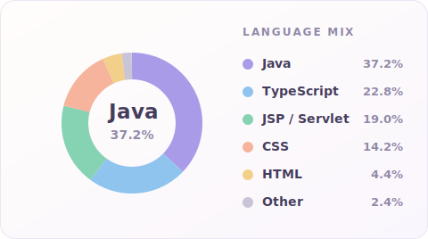

 

## 👋 About

**요식업 헤드셰프에서 개발자로.**
현장에서 5년 반, 조리 자격증 없이 실력만으로 **헤드셰프**까지 올라 직원 관리·발주·레시피를 책임졌습니다.
매일 쏟아지는 주문을 순서와 구조로 정리하던 감각을, 지금은 **얽힌 규칙을 코드로 푸는 일**에 그대로 쓰고 있습니다.

포켓몬 18타입 상성표를 손으로 설계하고, 관람 이력을 뱃지 24종으로 집계하는 로직을 짜면서 — **규칙이 복잡할수록 오히려 재미있어하는 사람**이라는 걸 알게 됐습니다.

 

 

## 🧰 Tech Stack

<table>
<tr>
<td valign="middle"><b>Backend</b></td>
<td>

</td>
</tr>
<tr>
<td valign="middle"><b>Database</b></td>
<td>

</td>
</tr>
<tr>
<td valign="middle"><b>Frontend</b></td>
<td>

</td>
</tr>
<tr>
<td valign="middle"><b>Tools</b></td>
<td>

</td>
</tr>
</table>

 

## 📦 Projects

 

### 🌌 KNOWVA — 우주 컨셉 코딩 학습 e러닝 플랫폼

<samp>팀 7명 · 2026.06 ~ 진행 중 · <b>learning(학습) 도메인 담당</b> · <a href="https://github.com/hyunkyumlee/Acorn-E-Learning">repo ↗</a></samp>

행성을 하나씩 밟아 진도를 쌓는 학습 로드맵 서비스입니다. 학습 도메인의 `Controller → Service → Mapper → View` 세로 전 구간을 맡아, 도메인마다 흩어지던 단계 잠금해제를 **`UnlockService` 하나로 통일**해 정합성을 잡았습니다. 우주 행성 콘셉트의 로드맵 화면도 디자이너 없이 직접 설계·구현했습니다.

<samp>`Java` · `Spring Boot` · `MyBatis` · `MySQL` · `Thymeleaf` · `OAuth2` · `ChatGPT API`</samp>

### 🎬 Popflix — 영화 예매 · 리뷰 · 필름 다이어리

<samp>팀 5명 · 2026.05 · <b>필름 다이어리 제안·전담 · DB 설계 · 최종 발표</b> · <a href="https://github.com/lastsummer0830/webProj_Popflex">repo ↗</a></samp>

관람 기록을 일기처럼 남기는 **필름 다이어리**를 직접 제안하고 전담 구현했습니다. 뱃지를 테이블에 저장하지 않고 **조회 시점 동적 집계**로 바꿔 동기화 문제를 없앴고, 관람 기록 중복은 **`reservation_id` UNIQUE 제약**으로 DB 레벨에서 차단했습니다.

<samp>`Java` · `Servlet/JSP(MVC2)` · `Oracle` · `KMDb OpenAPI` · `OAuth2` · `Maven`</samp>

### 🎮 pokemonJava — Java Swing 턴제 배틀 게임

<samp>팀 4명 · 2026.03 ~ 2026.04 · <b>전체 설계 주도 · 배틀 엔진 · 타입 상성</b> · <a href="https://github.com/lastsummer0830/pokemonJava">repo ↗</a></samp>

포켓몬 시스템 규칙을 팀에서 가장 깊이 이해해 **전체 설계를 주도**했습니다. 클래스 구조와 데이터 스키마를 설계해 팀원이 각자 파트를 구현하게 하고, 코드 리뷰와 통합·검증을 맡았습니다. **18타입 상성 · 6종 상태이상 · 진화**를 외부 API 없이 전부 직접 설계했습니다.

<samp>`Java` · `Java Swing` · `OOP(상속·다형성·인터페이스)` · `Collection`</samp>
· 맵 이동과 세이브/로드는 팀원이 구현했습니다.

### 🛋 공간이 머무는 곳 — 반응형 가구 · 인테리어 쇼핑몰

<samp>팀 4명 · 2026.02 · <b>조장 · 서브 컨셉 페이지 · 상품 상세 · 이미지 에셋</b> · <a href="https://github.com/lastsummer0830/where-space-lives">repo ↗</a></samp>

조장으로 **feature 브랜치 + Pull Request 워크플로우를 도입**해, 팀 전체 **PR 65건이 충돌 없이 통합**되도록 운영했습니다. 서브 컨셉 페이지와 상품 상세, 상품 이미지 에셋을 담당했습니다.

<samp>`HTML5` · `CSS3` · `JavaScript` · `jQuery` · `Git/GitHub`</samp>

### 🏝 MyWorld — 3D 인터랙티브 포트폴리오

<samp>개인 · 진행 중 · <a href="https://github.com/lastsummer0830/MyWorld">repo ↗</a></samp>

아이소메트릭 디오라마 씬을 **외부 모델·텍스처 없이 순수 코드로** 만들고 있는 포트폴리오 사이트입니다.

<samp>`TypeScript` · `React` · `Three.js` · `Next.js`</samp>

 

## 🎓 Education

| | |
|---|---|
| **에이콘아카데미** · 자바 웹 개발자 양성과정 (K-Digital Training) | 2026.01 — 2026.07 수료 예정 |
| **학점은행제** · 컴퓨터공학 (공학사) | 2027.02 취득 예정 |
| **정화예술대학교** · 메이크업학과 (중퇴) | 2019.03 입학 · 1학기 재학 후 중퇴 |
| **사동고등학교** 졸업 | 2019.02 |

 

<samp>더 자세한 이력은 <a href="./RESUME.md">이력서</a>에서 볼 수 있습니다.</samp>

방문해 주셔서 감사합니다 :)

