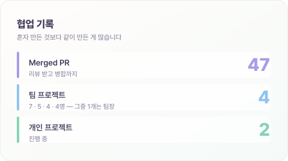

 

### 불편한 걸 말하는 쪽이 아니라, 직접 고치는 쪽이 되고 싶었습니다.

<samp>요식업 헤드셰프 → 풀스택 개발자 · 에이콘아카데미 수료 예정 (2026.07)</samp>

 

 

 

## 👋 About

요식업 현장에서 **5년 반**을 일했습니다.
조리 자격증 없이 실력만으로 **헤드셰프**까지 올라가 직원 관리와 발주, 레시피 관리를 맡았습니다.

거기서 멈추지 않고 개발로 방향을 튼 건, 불편한 걸 말하는 쪽이 아니라 **직접 고치는 쪽**이 되고 싶어서였습니다.

지금은 **규칙이 얽힌 데이터를 구조로 푸는 일**이 제일 즐겁습니다.
포켓몬 타입 상성표를 손으로 설계하다 키 하나가 안 맞아 며칠을 헤맸던 것도, 결국 그게 재미있어서 계속 붙잡고 있었습니다.

 

## 📦 Projects

### 🌌 KNOWVA — 우주 컨셉 코딩 학습 e러닝 플랫폼

<samp>팀 7명 · 2026.06 ~ 진행 중 · <b>learning(학습) 도메인 담당</b> · <a href="https://github.com/hyunkyumlee/Acorn-E-Learning">repo ↗</a></samp>

학습자가 **행성을 하나씩 밟아 나가며 진도를 쌓는** 학습 로드맵 서비스입니다.
저는 **학습(learning) 도메인**을 맡아 `Controller → Service → Mapper → View` 세로 전 구간을 구현했습니다.

- **단계 잠금해제를 `UnlockService` 하나로 모았습니다.** 도메인마다 잠금 상태를 제각기 건드리면 정합성이 깨지기 때문에, AI 코딩테스트 등 다른 도메인도 이 서비스를 거치도록 통일했습니다. (`exam` 도메인이 실제로 이 서비스를 호출합니다)
- **출석·연속출석(streak)은 학습 도메인이 쓰기 owner로 소유**하고 랭킹·마이페이지는 읽기만 하도록 경계를 나눴습니다.
- 커리큘럼 · 이론 레슨 · 진행률 · 북마크 · 레벨 테스트를 모델부터 화면까지 구현했고, **레벨 테스트 8문항의 제출·채점·결과 반영은 하나의 트랜잭션**으로 묶었습니다.
- **우주 행성 콘셉트의 학습 로드맵 화면을 디자이너 없이 직접 설계·구현**했습니다.

<samp>`Java` `Spring Boot` `MyBatis` `MySQL` `Thymeleaf` `OAuth2(Google·GitHub)` `ChatGPT API` `KakaoPay 결제`</samp>
· learning 패키지 커밋 26건 중 21건, Merged PR 22건이 제 작업입니다.

 

### 🎬 Popflix — 영화 예매 · 리뷰 · 필름 다이어리

<samp>팀 5명 · 2026.05 · <b>필름 다이어리 모듈 직접 제안·전담 · DB 설계 · 최종 발표</b> · <a href="https://github.com/lastsummer0830/webProj_Popflex">repo ↗</a></samp>

관람 기록을 일기처럼 남기는 **필름 다이어리** 기능을 직접 제안하고 전담 구현했습니다.

- 관람 뱃지를 테이블에 저장했더니 관람·평점이 바뀔 때마다 동기화가 깨졌습니다 → **저장 대신 조회 시점 동적 집계**로 바꿔 정합성 문제를 없앴고, 새 뱃지 추가가 코드 한 줄로 끝나게 됐습니다.
- 새로고침·재요청에 관람 기록이 중복됐습니다 → **`reservation_id`에 UNIQUE 제약**을 걸어 DB 레벨에서 차단했습니다.
- '연속 관람' 뱃지가 연말·연초에 걸친 기록을 놓쳤습니다 → **ISO 주차(연도-주) 기준 판정**으로 다시 짰습니다.
- 감정 태그 · 팝콘 평점 · 연월 관람 통계 시각화와 **관람 이력 기반 뱃지 24종**을 예매 모듈과 연동했습니다.

<samp>`Java` `Servlet/JSP(MVC2)` `Oracle` `KMDb OpenAPI` `네이버 OAuth2` `JSTL` `Maven`</samp>

 

### 🎮 pokemonJava — Java Swing 턴제 배틀 게임

<samp>팀 4명 · 2026.03 ~ 2026.04 · <b>전체 설계 주도 · 배틀 엔진 · 타입 상성</b> · <a href="https://github.com/lastsummer0830/pokemonJava">repo ↗</a></samp>

<table>
<tr>
<td width="52%"></td>
<td width="48%"></td>
</tr>
</table>

팀에서 포켓몬 시스템 규칙을 가장 깊이 파악하고 있어 **전체 설계를 주도**했습니다.
클래스 구조와 데이터 스키마를 설계해 팀원이 각자 파트를 구현할 수 있게 하고, 코드 리뷰와 통합·동작 검증을 맡았습니다.

- **18타입 상성표(이중 Map) · 6종 상태이상 · 진화 · 레벨업 기술 습득** — 외부 API 없이 데이터를 전부 직접 설계
- 단일·이중 타입 데미지 계산의 분기가 복잡했습니다 → **타입이 없으면 1.0을 곱하는 곱연산으로 통일**해 하나의 메서드로 처리했습니다.
- `BattleLogger` **인터페이스로 출력을 추상화** — 같은 전투 로직을 콘솔과 Swing UI 양쪽에서 재사용

> **트러블슈팅** — 타입 상성표에 키를 `"불"`로 넣고 조회는 `"불꽃"`으로 하고 있었습니다.
> 예외 없이 조용히 1.0배로 떨어져서 며칠을 헤맸고, **데이터 키를 한 곳에서만 정의하도록** 정리해 해결했습니다.
> 위 배틀 화면의 `야돈(에스퍼/물)`에 걸린 `화상`이 상성·상태이상이 실제로 도는 화면입니다.

<samp>`Java` `Java Swing` `OOP(상속·다형성·인터페이스)` `Collection(Map)`</samp>
· 맵 이동과 세이브/로드는 팀원이 구현했습니다.

 

### 🛋 공간이 머무는 곳 — 반응형 가구 · 인테리어 쇼핑몰

<samp>팀 4명 · 2026.02 · <b>조장 — 일정 관리 · 코드 통합, 메인/상세 프론트엔드</b> · <a href="https://github.com/lastsummer0830/acorn-interior-shop">repo ↗</a></samp>

4명이 동시에 작업하며 코드 충돌이 잦았습니다.
조장으로 **feature 브랜치 + Pull Request 워크플로우를 도입**해, 팀 전체 **PR 65건이 충돌 없이 통합**되도록 운영했습니다.

- 메인 · 네비게이션 · 제품 목록/상세 · BEST 섹션을 마크업부터 인터랙션까지 구현
- 반응형 레이아웃 적용 후 **GitHub Pages로 배포**

<samp>`HTML5` `CSS3` `JavaScript` `Git/GitHub` `GitHub Pages`</samp>

 

### 🏝 MyWorld — 3D 인터랙티브 포트폴리오

<samp>개인 · 진행 중 · <a href="https://github.com/lastsummer0830/MyWorld">repo ↗</a></samp>

아이소메트릭 디오라마 씬을 **외부 모델·텍스처 없이 순수 코드로** 만들고 있는 포트폴리오 사이트입니다.

<samp>`TypeScript` `React` `Three.js` `Next.js`</samp>

 

## 🧰 Tech Stack

**프로젝트에서 사용했습니다**

**수업에서 실습했습니다** — 아직 프로젝트에 적용해 본 단계는 아닙니다

 

## 🎓 Education

| | |
|---|---|
| **에이콘아카데미** · 자바 웹 개발자 양성과정 (K-Digital Training) | 2026.01 — 2026.07 수료 예정 |
| **학점은행제** · 컴퓨터공학 (공학사) | 2027.02 취득 예정 |
| **정화예술대학교** · 메이크업학과 (중퇴) | 2019 입학 |
| **사동고등학교** | 2019.02 졸업 |

 

## 📮 Contact

 

방문해 주셔서 감사합니다 :)

