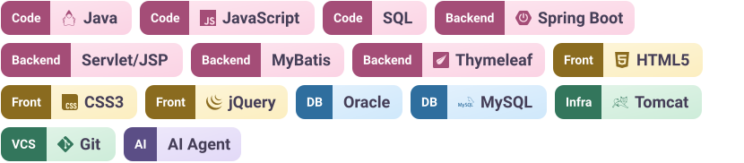

 

 

## About

**Java · Spring 기반 백엔드 개발자.**

- **AI 에이전트 활용** — 컨텍스트 설계 · 규칙 배선 · 검증 루틴을 직접 짜서 개발과 문서 작업을 에이전트로 운영. AI Agent 특강 수료(2026.05).
- **DB 모델링** — 요구사항에서 엔티티를 뽑아 스키마로 설계. Oracle · MySQL, 15개 테이블 규모.
- **도메인 설계** — 기능을 도메인 단위로 쪼개고 서비스 계층에 책임 배치.
- **서버 구현** — Spring Boot · MyBatis 기반. Servlet/JSP MVC2 구조도 취급.
- **직접 구현** — 게임 엔진 없이 2D 타일 RPG. 18타입 상성 엔진 · 픽셀 검증 파이프라인 자체 제작.

 

## Summary

| 구분 | 내용 |
|---|---|
| **학력** | 학점은행제 공학사(컴퓨터공학) 이수 중 · 2027.02 취득 예정 |
| **교육** | 에이콘아카데미 KDT 자바 웹개발자 과정 수료 (2026.01 ~ 07) · 팀 프로젝트 4건 |
| **수상** | 에이콘 KDT 과정 우수상 — 과정 전체 1명 수여 (2026.07) |
| **자격** | 정보처리기사 2026.12 취득 예정 |

 

## Tech Stack

 

## Projects

| 프로젝트 | 스택 | 요약 |
|---|---|---|
| **[KNOWVA](https://github.com/hyunkyumlee/Acorn-E-Learning)** `팀 7명` · `2026.06 ~ 07` | Java · Spring Boot MyBatis · MySQL | **learning 도메인 담당.** 행성을 하나씩 밟아 진도를 쌓는 코딩 학습 로드맵 |
| **[Popflix](https://github.com/lastsummer0830/webProj_Popflex)** `팀 5명` · `2026.05` | Java · Servlet/JSP Oracle | **필름 다이어리 모듈 · DB 설계 담당.** 영화 예매와 관람 기록을 묶은 서비스 |
| **[pokemonJava](https://github.com/lastsummer0830/pokemonJava)** `팀 4명` · `2026.03` | Java · Swing Gradle | **전체 설계 주도 · 배틀/상성 엔진 담당.** 18타입 상성표를 직접 설계한 턴제 배틀 |
| **[Pokemon With](https://github.com/lastsummer0830/Pokemon_With)** `개인` · `2026.06 ~ 진행 중` | TypeScript · Phaser 3 Electron | **단독 개발.** 게임 엔진 없이 만드는 2D 타일 RPG. 원작 대조 픽셀 검증 파이프라인 자체 구축 |
